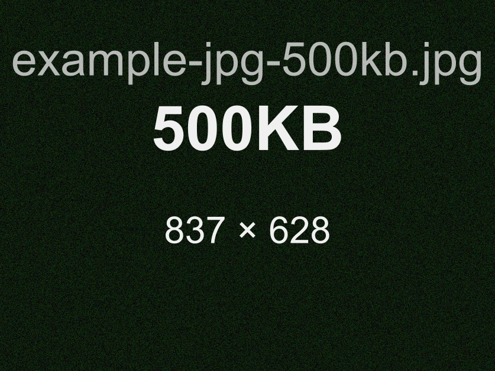
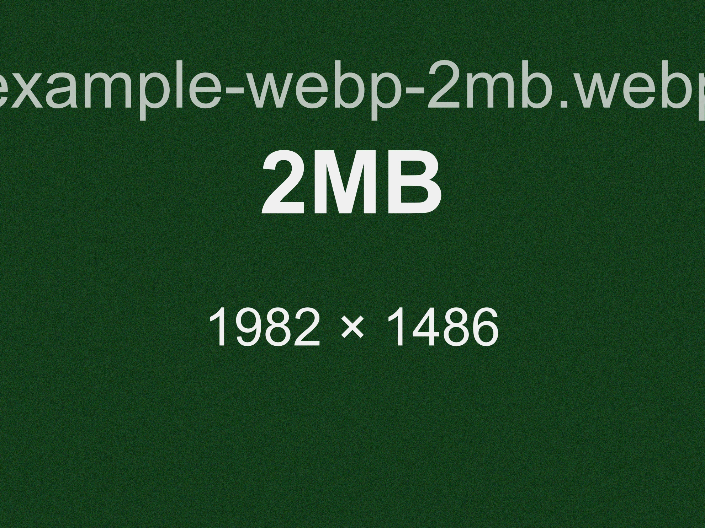
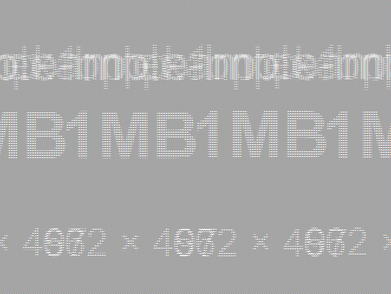
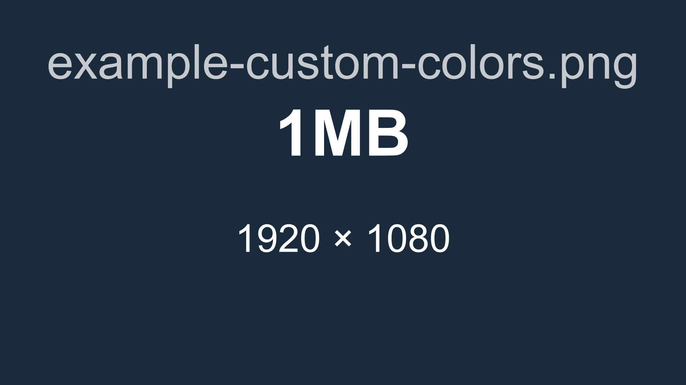

# imgen

[](https://www.npmjs.com/package/@liarcoder/image-generator)

[English](./docs/README-en_us.md) | 简体中文 | [更新日志](./CHANGELOG.md)

一个可以生成**指定文件大小**的命令行工具。

支持的格式：**PNG · JPG · WEBP · BMP · GIF**

每张图片都会填充随机柔和的背景色、自动对比度的文字叠加层（显示文件名、目标大小和像素尺寸），以及（针对有损格式）一层微妙的噪点，使 JPEG/WEBP 编码器能够通过质量参数二分搜索精确命中目标字节数。

---

## 环境要求

- Node.js **≥ 18**

## 安装

### 从 npm 安装（推荐）

```bash
npm i @liarcoder/image-generator
```

若要在任意目录直接使用 `imgen` 命令，请全局安装：

```bash
npm i -g @liarcoder/image-generator
```

也可以直接使用 `npx` 运行：

```bash
npx @liarcoder/image-generator
```

### 从源码安装

```bash
# 克隆仓库并安装依赖
git clone <repo-url>
cd image-generator
npm install

# 将命令添加到全局
npm link
```

## 使用方法

```
imgen -s <size> [options]
```

### 选项

| 选项                 | 简写                  | 说明                                        | 默认值           |
| -------------------- | --------------------- | ------------------------------------------- | ---------------- |
| `-s <number>`        | `--size`              | 目标文件大小 **（必填）**                   | —                |
| `-u <unit>`          | `--unit`              | 单位：`KB` 或 `MB`                          | `MB`             |
| `-f <type>`          | `--format`            | 输出格式：`png` `jpg` `webp` `bmp` `gif`    | `png`            |
| `-n <name>`          | `--name`              | 输出文件名（不含扩展名）                    | 自动生成         |
| `-o <dir>`           | `--output`            | 输出目录                                    | 当前目录         |
| `-d <WxH>`           | `--dimensions`        | 像素尺寸，如 `1920x1080`                    | 自动计算         |
| `--bg-color <hex>`   |                       | 背景颜色，如 `#336699`                      | 随机柔和色       |
| `--text-color <hex>` |                       | 文字颜色，如 `#FFFFFF`                      | 自动 WCAG 对比度 |
| `--verbose`          |                       | 显示详细进度信息                            | 关闭                |
| `-c`                 | `--copy-to-clipboard` | 生成后复制图片到系统剪切板（Windows/macOS） | 关闭             |
| `--quiet`            |                       | 安静模式，仅输出文件路径                    | 关闭                |
| `-v`                 | `--version`           | 显示版本号                                  | —                |
| `-h`                 | `--help`              | 显示帮助信息                                | —                |

`--verbose` 和 `--quiet` 不能同时使用。

### 约束条件

- 最大目标大小：**50 MB**
- 最小图像尺寸：任意一边不小于 **100 px**
- 当 `-d` 指定的尺寸与目标大小冲突时，**以大小为准**，尺寸仅作为参考起点
- 文件名中不允许出现 `\ / : * ? " < > |` 字符
- `--copy-to-clipboard` 仅支持 **Windows / macOS**，其他系统会提示并跳过复制
- Windows 下 `webp` 生成后不会复制到剪切板（会提示并跳过）

---

## 示例

### 基本用法

```bash
# 5 MB PNG（自动计算尺寸）
imgen -s 5

# 500 KB JPEG
imgen -s 500 -u KB -f jpg

# 2 MB WEBP，自定义文件名和输出目录
imgen -s 2 -f webp -n banner -o ./output
```

### 自定义尺寸和颜色

```bash
# 1920×1080 PNG，深蓝色背景 + 白色文字
imgen -s 2 -f png -d 1920x1080 --bg-color "#1a2b3c" --text-color "#ffffff"

# 精确 1 MB 的 BMP
imgen -s 1 -f bmp
```

### 脚本 / 管道

```bash
# 安静模式只返回文件路径，适合在脚本中使用
OUTPUT=$(imgen -s 1 -f png --quiet)
echo "已生成: $OUTPUT"
```

### 详细输出

```bash
imgen -s 3 -f jpg --verbose
```

### 复制到剪切板

```bash
# 生成后自动复制到剪切板
imgen -s 1 -f png -c

# Windows 下 WEBP 会跳过复制，但仍正常保存文件
imgen -s 1 -f webp -c
```

### 示例输出预览

<details open>
<summary>展开查看示例图片</summary>

| 示例           | 命令                                                                         | 生成图片                                        |
| -------------- | ---------------------------------------------------------------------------- | ----------------------------------------------- |
| PNG — 5 MB     | `imgen -s 5 -f png`                                                          |           |
| JPG — 500 KB   | `imgen -s 500 -u KB -f jpg`                                                  |       |
| WEBP — 2 MB    | `imgen -s 2 -f webp`                                                         |        |
| BMP — 1 MB     | `imgen -s 1 -f bmp`                                                          |           |
| 自定义颜色 PNG | `imgen -s 1 -f png -d 1920x1080 --bg-color "#1a2b3c" --text-color "#ffffff"` |  |

</details>

---

## 文件命名

未提供 `-n` 时，文件名自动生成，格式为：

```
<size><unit>-<YYYY-MM-DD-HH-mm-ss>.<format>
```

例如：`5MB-2026-04-05-14-30-00.png`

### 同名文件冲突

- **普通模式**：弹出交互式提示，可选择追加序号（`file-1.png`）、覆盖或取消。
- **安静模式**：自动追加序号，不弹出提示。

---

## 精度保证

| 格式 | 容差                              |
| ---- | --------------------------------- |
| PNG  | 精确（±0 字节，通过 tEXt 块填充） |
| GIF  | ±1 KB（通过注释扩展块填充）       |
| BMP  | 精确（追加零字节）                |
| JPG  | ±1% 或 ±5 KB，取较大者            |
| WEBP | ±1% 或 ±5 KB，取较大者            |

如果尺寸约束导致无法精确达到目标大小，`imgen` 会发出警告并保存最接近的结果。

---

## 开发

```bash
# 安装依赖
npm install

# 运行代码检查
npm run lint

# 自动修复可修复的 lint 问题
npm run lint:fix

# 执行格式化
npm run format

# 仅检查格式（不改文件）
npm run format:check

# 运行所有测试
npm test

# 运行单个测试文件
node --test test/adjuster.test.js

# 本地运行（无需全局安装）
node bin/imgen.js -s 1 -f png

# 使用详细输出进行调试
node bin/imgen.js -s 2 -f jpg --verbose
```

首次克隆后如果本地没有启用 Git hooks，可执行一次：

```bash
npm run prepare
```

提交时会自动通过 `husky + lint-staged` 对暂存的改动文件执行检查与格式化。

### 项目结构

```
bin/
  imgen.js          入口文件（shebang 包装器）
src/
  cli.js            参数解析与验证（commander）
  generator.js      主流程编排
  sizer.js          根据目标字节数自动计算像素尺寸
  color.js          随机柔和 HSL 颜色 + WCAG 对比度文字
  renderer.js       基于 sharp 的渲染，含 SVG 文字叠加
  adjuster.js       精确大小调整（填充 / 质量二分搜索）
  output.js         文件写入 + 冲突处理
  logger.js         三种输出模式（普通 / 详细 / 安静）
  constants.js      共享常量
test/
  cli.test.js
  sizer.test.js
  color.test.js
  adjuster.test.js
```

---

## 更新日志

详见 [CHANGELOG.md](./CHANGELOG.md)。英文版见 [docs/CHANGELOG-en_us.md](./docs/CHANGELOG-en_us.md)。

---

## 许可证

MIT
